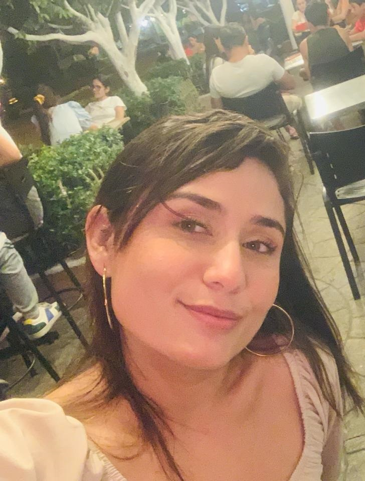

<!DOCTYPE html>
<html lang="es">
<head>
    <meta charset="UTF-8">
    <meta name="viewport" content="width=device-width, initial-scale=1.0">
    <title>Mi página romántica con side</title>
    
</head>
<body>
    <header>
        <h1>¡Te amo ERIKA ALEXANDRA!</h1>
    </header>
    <main>
        <nav>
            <ul>
                <li><a href="#">Inicio</a></li>
                <li><a href="#">Acerca de</a></li>
                <li><a href="#">Contacto</a></li>
            </ul>
        </nav>
        <article>
            <h2>Artículo principal</h2>
            <section>
                <h3>Carta</h3>
                
Amor de mi vida,

                    Es difícil encontrar las palabras adecuadas para expresar lo que siento por ti. Desde el momento en que entraste en mi vida, todo cambió. Tú has iluminado mi mundo de una manera que nunca imaginé posible. Quiero tomarme un momento para decirte lo mucho que significas para mí.
                    
                    Cada día a tu lado es un regalo del cielo. Tu presencia llena mi corazón de alegría y mi alma de calidez. Eres esa luz brillante que guía mi camino en los días oscuros y la brisa suave que me reconforta en los momentos de tempestad. Tu amor me envuelve como un abrazo cálido y me hace sentir seguro, protegido y amado.
                    
                    Lo que más admiro de ti es tu capacidad para ver lo mejor en mí, incluso cuando yo mismo dudo. Tú me haces sentir especial de una manera que nadie más ha logrado hacerlo. Tus palabras de aliento y apoyo son como un bálsamo para mi alma, levantándome cuando estoy caído y dándome fuerzas para seguir adelante.
                    
                    Tus acciones hablan más que mil palabras. Cada gesto de amor y amabilidad que haces hacia mí me recuerda lo afortunado que soy de tenerte en mi vida. Tú me haces sentir importante, valorado y apreciado en una forma que nunca antes había experimentado. Tu amor incondicional es el regalo más preciado que he recibido, y prometo cuidarlo y protegerlo siempre.
                    
                    En resumen, tú eres mi roca, mi inspiración, mi razón para sonreír cada día. Gracias por ser tú, por ser tan maravilloso y por amarme de una manera que me hace sentir completo. Te amo más de lo que las palabras pueden expresar, y siempre lo haré.
                    
                    Con todo mi amor,
                    
                    Jhon A. Pérez Pérez
                

            </section>
            <section>
                <h3>Dedicación</h3>
                <iframe width="560" height="315" src="https://www.youtube.com/embed/kgUVq-ICt_Y" frameborder="0" allowfullscreen style="max-width: 100%;"></iframe>
                
Este es el video que quería compartir contigo: <a href="https://www.youtube.com/watch?v=kgUVq-ICt_Y">https://www.youtube.com/watch?v=kgUVq-ICt_Y</a>

            </section>
        </article>
        <aside>
            <h2>Te amo Muñeca</h2>
            
            
Eres el ser más especial en mi vida... Te quiero para siempre a mi lado.

        </aside>
    </main>
</body>
</html>
